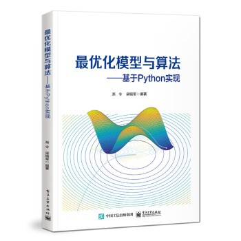

# 最优化模型与算法——基于 Python 实现

​	本书介绍了优化模型的基础知识，梳理了大数据和人工智能时代涌现出来的最优化算法，使用 Python语言配套给出算法的代码，展示了若干实例和应用案例。

​	**PS**：本书的读者只需要具备微积分和线性代数的基础知识。

## About

**作者简介**：

- **渐令**：中国石油大学（华东）教授、博导、副院长、泰山学者青年专家。在数据科学、运筹优化领域国际知名期刊、会议上发表学术论文50余篇，其中SCI期刊论文30余篇。在IEEE/ACM汇刊上发表论文9篇，在人工智能、数据挖掘顶级学术会议IJCAI、ICDM发表论文2篇，在数据挖掘、运筹优化领域主流期刊DMKD、EJOR发表论文2篇。目前，Google Scholar引用近1000次，H指数为17。
- **梁锡军**：中国石油大学（华东）副教授、博导。IEEE Member；担任 Knowledge and Information System 、BMC Genomics 等多个期刊审稿人。

**问题反馈**：如果有书籍或PDF的内容存在问题，可以联系编者。

## Contents

​	本书主要内容包括优化模型基础知识和优化算法两部分，介绍了凸集合、凸函数、凸优化模型、对偶理论，梳理了梯度下降法、牛顿法、乘子法、DC 规划算法、梯度投影法、随机梯度下降法、在线梯度下降法等优化算法。

### 目录

> **点击链接可跳转PDF课件、Latex文件、代码**

- 第 1 章 凸集合 
  [PDF](./resources/sec_1_Convex_sets/sec_1_Convex_sets_print.pdf) 
  [Latex](./resources/sec_1_Convex_sets/sec_1_Convex_sets.tex)
  - 1.1 仿射集、凸集和凸锥
  - 1.2 凸集合的示例
  - 1.3 保持凸性的运算
  - 1.4 支撑超平面
  - 1.5 对偶锥
  - 练习题
  - 参考文献
- 第 2 章 凸函数
  [PDF](./resources/sec_2_Convex_function/sec_2_Convex_function.pdf) 
  [Latex](./resources/sec_2_Convex_function/sec_2_Convex_function.tex)
  - 2.1 凸函数的定义和例子
  - 2.2 保持凸性的运算
  - 2.3 共轭函数
  - 2.4 次梯度与次微分
  - 2.5 对偶
  - 练习题
  - 参考文献
- 第 3 章 凸优化函数
  [PDF](./resources/sec_3_Convex_optimization_problems/sec_3_Convex_optimization_problems.pdf) 
  [Latex](./resources/sec_3_Convex_optimization_problems/sec_3_Convex_optimization_problems.tex)
  - 3.1 优化模型
  - 3.2 凸优化模型
  - 3.3 线性规划
  [案例代码](./resources/sec_3_Convex_optimization_problems/code)
  - 3.4 二次规划模型
  [案例代码](./resources/sec_3_Convex_optimization_problems/code)
  - 3.5 几何规划
  - 3.6 广义不等式约束
  [案例代码](./resources/sec_3_Convex_optimization_problems/code)
  - 3.7 半定规划
  - 练习题
  - 参考文献
- 第 4 章 对偶理论
  [PDF](./resources/sec_4_Duality/sec_4_Duality.pdf) 
  [Latex](./resources/sec_4_Duality/sec_4_Duality.tex)
  - 4.1 Lagrange 对偶函数
  - 4.2 Lagrange 对偶问题
  - 4.3 Lagrange 对偶的理解 
  - 4.4 最优性条件 
  - 练习题
  - 参考文献
- 第 5 章 非凸优化算法
  - 5.1 全局优化算法的复杂度
  [PDF](./resources/sec_5.1_3_nonlinear_opt/sec_5.1_3_nonlinear_opt.pdf) 
  [Latex](./resources/sec_5.1_3_nonlinear_opt/sec_5.1_3_nonlinear_opt.tex)
  [案例代码](./resources/sec_5.1_3_nonlinear_opt/code/应用案例5.1%20CCCP求解DC规划问题代码)
  - 5.2 优化算法构造思想
  [PDF](./resources/sec_5.1_3_nonlinear_opt/sec_5.1_3_nonlinear_opt.pdf) 
  [Latex](./resources/sec_5.1_3_nonlinear_opt/sec_5.1_3_nonlinear_opt.tex)
  - 5.3 梯度下降法
  [PDF](./resources/sec_5.1_3_nonlinear_opt/sec_5.1_3_nonlinear_opt.pdf) 
  [Latex](./resources/sec_5.1_3_nonlinear_opt/sec_5.1_3_nonlinear_opt.tex)
  [案例代码](./resources/sec_5.1_3_nonlinear_opt/code/实例代码%205.3.1%20梯度下降法求解logistic%20回归模型.py)
  - 5.4 牛顿法
  [PDF](./resources/sec_5.4_5_牛顿法拟牛顿法/sec_5.4_5_牛顿法拟牛顿法.pdf) 
  [Latex](./resources/sec_5.4_5_牛顿法拟牛顿法/sec_5.4_5_牛顿法拟牛顿法.tex)
  [案例代码](./resources/sec_5.4_5_牛顿法拟牛顿法/code/实例5.4.1%20%20牛顿法计算开根.py)
  - 5.5 拟牛顿法
  [PDF](./resources/sec_5.4_5_牛顿法拟牛顿法/sec_5.4_5_牛顿法拟牛顿法.pdf) 
  [Latex](./resources/sec_5.4_5_牛顿法拟牛顿法/sec_5.4_5_牛顿法拟牛顿法.tex)
  [案例代码](./resources/sec_5.4_5_牛顿法拟牛顿法/code/实例代码5.5.1%20BFGS算法求解logistic模型-20230127.py)
  - 5.6 共轭梯度法
  [PDF](./resources/sec_5.6_共轭梯度法/sec_5.6_共轭梯度法.pdf)
  [Latex](./resources/sec_5.6_共轭梯度法/sec_5.6_共轭梯度法.tex)
  - 5.7 最小二乘问题
  [PDF](./resources/sec_5.7_最小二乘法/sec_5.7_Least_square.pdf)
  [Latex](./resources/sec_5.7_最小二乘法/sec_5.7_Least_square.tex)
  - 5.8 Lagrange 乘子法
  [PDF](./resources/sec_5.8_Lagrange乘子法/sec_5.8_拉格朗日乘子法.pdf)
  [Latex](./resources/sec_5.8_Lagrange乘子法/sec_5.8_拉格朗日乘子法.tex)
  - 5.9 DC 规划及 CCCP 算法
  [PDF](./resources/sec_5.9_DC_programming_CCCP/sec_5.9_DC_programming_CCCP.pdf)
  [Latex](./resources/sec_5.9_DC_programming_CCCP/sec_5.9_DC_programming_CCCP.tex)
  - 5.10 进化算法
  [PDF](./resources/sec_5.10_进化算法/sec_5.10_进化算法.pdf)
  [Latex](./resources/sec_5.10_进化算法/sec_5.10_进化算法.tex)
  [案例代码](./resources/sec_5.10_进化算法/code/应用案例5.10.1%20%20%20差分进化算法求解无约束二次优化问题.py)
  - 练习题
  - 参考文献
- 第 6 章 凸优化算法
  - 6.1 梯度投影法
  [PDF](./resources/sec_6.1_梯度投影法/sec_6.1_Gradient_Projection_Methods.pdf)
  [Latex](./resources/sec_6.1_梯度投影法/sec_6.1_Gradient_Projection_Methods.tex)
  [案例代码](./resources/sec_5.10_进化算法/code/应用案例5.10.1%20%20%20差分进化算法求解无约束二次优化问题.py)
  - 6.2 坐标下降法
  [PDF](./resources/sec_6.2_坐标下降法/sec_6.2_Coordinate_descent.pdf)
  [Latex](./resources/sec_6.2_坐标下降法/sec_6.2_Coordinate_descent.tex)
  [案例代码](./resources/sec_6.2_坐标下降法/code/实例6.2.1坐标下降法求解线性方程组.py)
  - 6.3 迫近梯度法
  [PDF](./resources/sec_6.3_迫近梯度法/sec_6.3_Proxiaml_Gradient_Method.pdf)
  [Latex](./resources/sec_6.3_迫近梯度法/sec6-3-Proxiaml-Gradient-Method.tex)
  [案例代码](./resources/sec_6.3_迫近梯度法/code/实例6.3.2%20迫近梯度法求解Lasso%20问题.py)
  - 6.4 交替方向乘子法
  [PDF](./resources/sec_6.4_交替方向乘子法/sec_6.4_ADMM.pdf)
  [Latex](./resources/sec_6.4_交替方向乘子法/sec_6.4_ADMM.tex)
  [案例代码](./resources/sec_6.4_交替方向乘子法/code)
  - 6.5 随机梯度下降法
  [PDF](./resources/sec_6.5_SGD/sec_6.5_SGD.pdf)
  [Latex](./resources/sec_6.5_SGD/sec_6.5_SGD.tex)
  [案例代码](./resources/sec_6.5_SGD/code/实例代码6.5.1%20SGD求解logistic回归模型.py)
  - 6.6 在线凸优化
  - 练习题
  - 参考文献

> **目前本书已上架京东平台**
> [京东购买链接](https://item.jd.com/13401179.html#comment)

